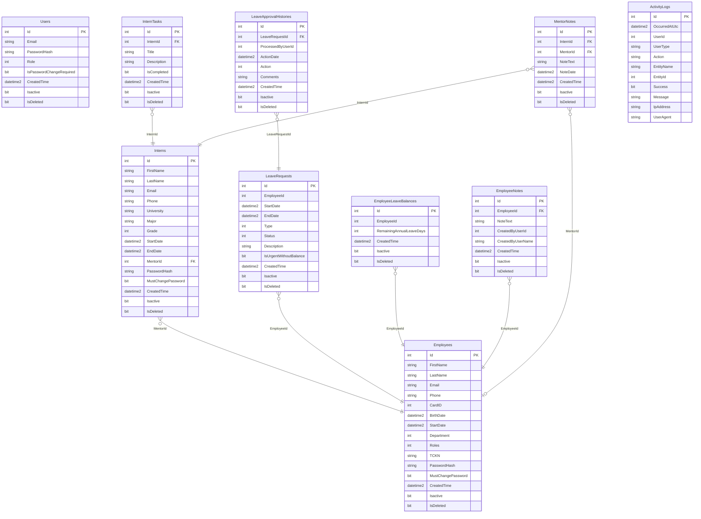

# HRSupport — Veri Modeli ve ER Diyagramı

Bu doküman, HRSupport uygulamasının veritabanı şemasını ve varlıklar arası ilişkileri (Entity-Relationship) açıklar. Şema, EF Core migration’ları ve Domain entity’leri ile uyumludur.

---

## 1. Tablolar Özeti

| Tablo                      | Açıklama                                                        |
| -------------------------- | --------------------------------------------------------------- |
| **Users**                  | Sistem kullanıcıları (Admin, İK); e-posta + şifre ile giriş     |
| **Employees**              | Çalışanlar (İK, Yönetici, Çalışan rolleri); giriş bilgisi dahil |
| **Interns**                | Stajyerler; mentor (Employee) ile ilişkili                      |
| **LeaveRequests**          | İzin talepleri; çalışana bağlı                                  |
| **LeaveApprovalHistories** | İzin onay/red geçmişi; talebe bağlı                             |
| **EmployeeLeaveBalances**  | Çalışan yıllık izin bakiyesi                                    |
| **EmployeeNotes**          | Çalışana ait notlar (HR/Yönetici)                               |
| **InternTasks**            | Stajyere verilen görevler                                       |
| **MentorNotes**            | Mentorun stajyer için geri bildirim notları                     |
| **ActivityLogs**           | Giriş/çıkış ve işlem audit kayıtları                            |

---

## 2. Tablo Detayları (Kolonlar)

### 2.1. Users

Sistem kullanıcıları (Admin, İK). Employees ve Interns tabloları da giriş hesabı tutar.

| Kolon                    | Tip                | Açıklama                                              |
| ------------------------ | ------------------ | ----------------------------------------------------- |
| Id                       | int (PK, Identity) | Birincil anahtar                                      |
| Email                    | nvarchar(max)      | E-posta (giriş için)                                  |
| PasswordHash             | nvarchar(max)      | BCrypt hash                                           |
| Role                     | int                | Enum: Admin=1, IK=2, Yönetici=3, Çalışan=4, Stajyer=5 |
| IsPasswordChangeRequired | bit                | İlk girişte şifre değiştir                            |
| CreatedTime              | datetime2          |                                                       |
| Isactive                 | bit                |                                                       |
| IsDeleted                | bit                | Soft delete                                           |

---

### 2.2. Employees

Çalışan kaydı; departman, rol ve giriş bilgisi içerir.

| Kolon              | Tip                | Açıklama                           |
| ------------------ | ------------------ | ---------------------------------- |
| Id                 | int (PK, Identity) |                                    |
| FirstName          | nvarchar(max)      |                                    |
| LastName           | nvarchar(max)      |                                    |
| Email              | nvarchar(max)      |                                    |
| Phone              | nvarchar(max)      |                                    |
| CardID             | int                |                                    |
| BirthDate          | datetime2          |                                    |
| StartDate          | datetime2          | İşe giriş tarihi                   |
| Department         | int                | Enum (Yazilim, InsanKaynaklari, …) |
| Roles              | int                | Enum: Admin, IK, Yönetici, Çalışan |
| TCKN               | nvarchar(max)      | Opsiyonel                          |
| PasswordHash       | nvarchar(max)      | Çalışan girişi için                |
| MustChangePassword | bit                |                                    |
| CreatedTime        | datetime2          |                                    |
| Isactive           | bit                |                                    |
| IsDeleted          | bit                |                                    |

---

### 2.3. Interns

Stajyer kaydı; mentor (Employee) ile ilişkilidir.

| Kolon              | Tip                | Açıklama         |
| ------------------ | ------------------ | ---------------- |
| Id                 | int (PK, Identity) |                  |
| FirstName          | nvarchar(max)      |                  |
| LastName           | nvarchar(max)      |                  |
| Email              | nvarchar(max)      |                  |
| Phone              | nvarchar(max)      |                  |
| University         | nvarchar(max)      | Opsiyonel        |
| Major              | nvarchar(max)      | Bölüm, opsiyonel |
| Grade              | int                | Sınıf            |
| StartDate          | datetime2          | Staj başlangıç   |
| EndDate            | datetime2          | Staj bitiş       |
| MentorId           | int? (FK)          | Employees.Id     |
| PasswordHash       | nvarchar(max)      |                  |
| MustChangePassword | bit                |                  |
| CreatedTime        | datetime2          |                  |
| Isactive           | bit                |                  |
| IsDeleted          | bit                |                  |

---

### 2.4. LeaveRequests

İzin talepleri; bir çalışana aittir.

| Kolon                  | Tip                | Açıklama                                     |
| ---------------------- | ------------------ | -------------------------------------------- |
| Id                     | int (PK, Identity) |                                              |
| EmployeeId             | int                | Hangi çalışan (Employees.Id)                 |
| StartDate              | datetime2          |                                              |
| EndDate                | datetime2          |                                              |
| Type                   | int                | Enum: Yıllık, Ücretsiz, Hastalık, …          |
| Status                 | int                | Enum: Beklemede=0, Onaylandı=1, Reddedildi=2 |
| Description            | nvarchar(max)      |                                              |
| IsUrgentWithoutBalance | bit                | Acil izin bakiye yokken                      |
| CreatedTime            | datetime2          |                                              |
| Isactive               | bit                |                                              |
| IsDeleted              | bit                |                                              |

---

### 2.5. LeaveApprovalHistories

Bir izin talebinin onay/red geçmişi.

| Kolon             | Tip                | Açıklama                                        |
| ----------------- | ------------------ | ----------------------------------------------- |
| Id                | int (PK, Identity) |                                                 |
| LeaveRequestId    | int (FK)           | LeaveRequests.Id                                |
| ProcessedByUserId | int                | Onaylayan/reddeden kullanıcı (User/Employee Id) |
| ActionDate        | datetime2          |                                                 |
| Action            | int                | Enum: Beklemede, Onaylandı, Reddedildi          |
| Comments          | nvarchar(max)      | Açıklama (red gerekçesi vb.)                    |
| CreatedTime       | datetime2          |                                                 |
| Isactive          | bit                |                                                 |
| IsDeleted         | bit                |                                                 |

---

### 2.6. EmployeeLeaveBalances

Çalışan başına yıllık izin bakiyesi (genelde tek satır).

| Kolon                    | Tip                | Açıklama               |
| ------------------------ | ------------------ | ---------------------- |
| Id                       | int (PK, Identity) |                        |
| EmployeeId               | int                | Employees.Id           |
| RemainingAnnualLeaveDays | int                | Kalan yıllık izin günü |
| CreatedTime              | datetime2          |                        |
| Isactive                 | bit                |                        |
| IsDeleted                | bit                |                        |

---

### 2.7. EmployeeNotes

Çalışana ait notlar (HR veya Yönetici tarafından).

| Kolon             | Tip                | Açıklama                |
| ----------------- | ------------------ | ----------------------- |
| Id                | int (PK, Identity) |                         |
| EmployeeId        | int (FK)           | Employees.Id            |
| NoteText          | nvarchar(max)      |                         |
| CreatedByUserId   | int                | Notu giren kullanıcı Id |
| CreatedByUserName | nvarchar(max)      | Görüntüleme için ad     |
| CreatedTime       | datetime2          |                         |
| Isactive          | bit                |                         |
| IsDeleted         | bit                |                         |

---

### 2.8. InternTasks

Stajyere verilen görevler.

| Kolon       | Tip                | Açıklama   |
| ----------- | ------------------ | ---------- |
| Id          | int (PK, Identity) |            |
| InternId    | int (FK)           | Interns.Id |
| Title       | nvarchar(max)      |            |
| Description | nvarchar(max)      | Opsiyonel  |
| IsCompleted | bit                |            |
| CreatedTime | datetime2          |            |
| Isactive    | bit                |            |
| IsDeleted   | bit                |            |

---

### 2.9. MentorNotes

Mentorun stajyer için geri bildirim notları.

| Kolon       | Tip                | Açıklama                 |
| ----------- | ------------------ | ------------------------ |
| Id          | int (PK, Identity) |                          |
| InternId    | int (FK)           | Interns.Id               |
| MentorId    | int? (FK)          | Employees.Id             |
| NoteText    | nvarchar(max)      |                          |
| NoteDate    | datetime2?         | Opsiyonel (haftalık vb.) |
| CreatedTime | datetime2          |                          |
| Isactive    | bit                |                          |
| IsDeleted   | bit                |                          |

---

### 2.10. ActivityLogs

Giriş, çıkış ve kritik işlem logları (audit).

| Kolon         | Tip                | Açıklama                                     |
| ------------- | ------------------ | -------------------------------------------- |
| Id            | int (PK, Identity) |                                              |
| OccurredAtUtc | datetime2          |                                              |
| UserId        | int?               | İşlemi yapan (User/Employee/Intern Id)       |
| UserType      | nvarchar(max)      | "User", "Employee", "Intern"                 |
| Action        | nvarchar(max)      | Login, ChangePassword, CreateLeaveRequest, … |
| EntityName    | nvarchar(max)      | Opsiyonel                                    |
| EntityId      | int?               | Opsiyonel                                    |
| Success       | bit                |                                              |
| Message       | nvarchar(max)      | Opsiyonel                                    |
| IpAddress     | nvarchar(max)      | Opsiyonel                                    |
| UserAgent     | nvarchar(max)      | Opsiyonel                                    |

---

## 3. İlişkiler (Foreign Key’ler)

| Ana tablo              | İlişki | Bağlı tablo                    | Açıklama                 |
| ---------------------- | ------ | ------------------------------ | ------------------------ |
| Interns                | N:1    | Employees (MentorId)           | Stajyerin mentoru        |
| LeaveRequests          | N:1    | Employees (EmployeeId)         | Talebin sahibi çalışan   |
| LeaveApprovalHistories | N:1    | LeaveRequests (LeaveRequestId) | Talebin onay geçmişi     |
| EmployeeLeaveBalances  | N:1    | Employees (EmployeeId)         | Çalışanın bakiyesi       |
| EmployeeNotes          | N:1    | Employees (EmployeeId)         | Çalışana ait notlar      |
| InternTasks            | N:1    | Interns (InternId)             | Stajyere ait görevler    |
| MentorNotes            | N:1    | Interns (InternId)             | Stajyere ait mentor notu |
| MentorNotes            | N:1    | Employees (MentorId)           | Notu yazan mentor        |

**Not:** Users tablosu ile Employees/Interns arasında veritabanı FK yok; giriş kimliği JWT ve uygulama katmanında eşleştirilir (aynı Id ile User, Employee veya Intern).

---

## 4. ER Diyagramı (Mermaid)

Aşağıdaki diyagram, GitHub / GitLab / VS Code (Mermaid eklentisi) vb. ortamlarda görselleştirilir.

---

## 5. Enum Değerleri (Referans)

**Roles:** Admin=1, IK=2, Yönetici=3, Çalışan=4, Stajyer=5  

**Department:** Yazılım, İnsan Kaynakları, Muhasebe, … (Domain/Enum/Department.cs)  

**LeaveType:** Yıllık, Ücretsiz, Hastalık, Doğum, Ölüm, … (Domain/Enum/LeaveType.cs)  

**LeaveStatus:** Beklemede=0, Onaylandı=1, Reddedildi=2 (Domain/Enum/LeaveStatus.cs)

---

*Bu doküman, HRSupport çözümündeki mevcut migration ve Domain entity’lerine göre üretilmiştir. Şema değişikliği yapıldığında dokümanın güncellenmesi önerilir.*